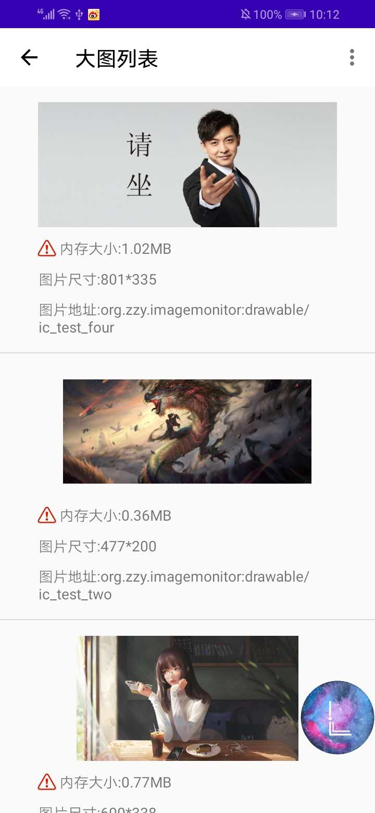
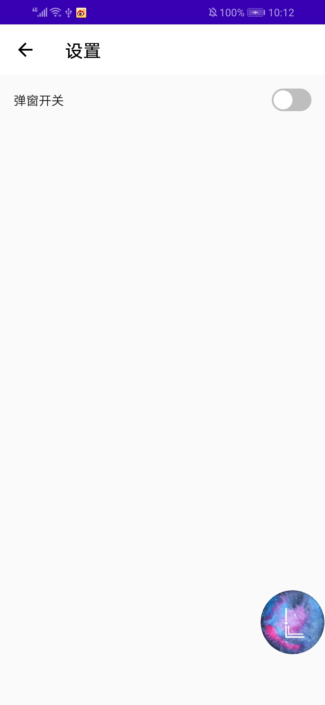
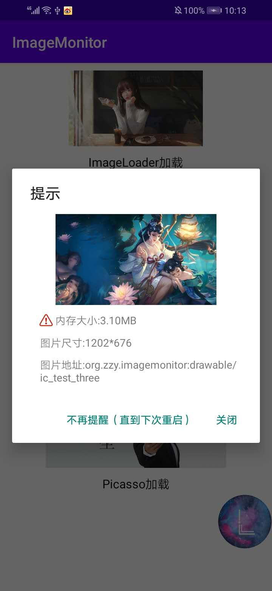

# LargeImageMonitor

<h1 align="center">
  
 </h1>
 
 [](https://bintray.com/zzy/imageMonitor/large-image-monitor/1.0.0/link)
 
 
 
 
### 背景
 在平时开发中，我们经常会出现OOM和APK体积过大的情况，其中有很大的原因在于图片过大。当图片占用内存过大，内存不足时就会导致OOM。而图片的文件太大，会导致在打包成APK后，APK的体积增加。对于本地加载的图片，UI给我们图时，我们或许会下意识看一眼文件大小，如果文件太大我们可能会跟UI小姐姐进行沟通。但是对于从网络加载图片，很多时候客户端拿到的只是一个URL，我们并不知道要加载的图片大小，这时候就有可能造成图片过大的情况。
 
### 介绍
LargeImageMonitor是一个使用ASM进行字节码插桩的大图监控框架，可以对我们要加载的图片进行监控，如果出现图片超过阈值的情况会进行报警。

### 功能与特点
&nbsp;&nbsp;&nbsp;&nbsp;1.支持Glide,Fresco,Picasso,Universal Image Loader。

&nbsp;&nbsp;&nbsp;&nbsp;2.可以对图片的文件大小设置阈值。

&nbsp;&nbsp;&nbsp;&nbsp;3.可以对图片所占用的内存大小设置阈值。

&nbsp;&nbsp;&nbsp;&nbsp;4.可以通过弹窗或者列表的方式查看超过阈值的图片。

&nbsp;&nbsp;&nbsp;&nbsp;5.可以为Okhttp添加全局的应用监听器和网络监听器（包括第三方使用到的okhttp也会添加上）。

&nbsp;&nbsp;&nbsp;&nbsp;6.可以为Okhttp添加全局的自定义DNS，方便实现HTTPDNS（包括第三方使用到的okhttp也会添加上）。

&nbsp;&nbsp;&nbsp;&nbsp;6.支持Androidx。

### 效果
<p float="left">
  
  
</p>
<p float="left">
  
  
</p>

### 快速接入
1.在根目录的build.gralde中添加如下代码:
```groovy
buildscript {
    //添加jcenter
    repositories {
        jcenter()
    }
    //添加插件classpath
    dependencies {
       classpath 'org.zzy.largeimage:large-image-monitor-plugin:1.0.0'
    }
}
```
2.在要使用的模块的build.gradle中添加如下代码：
```groovy
//添加使用插件
apply plugin: 'largeimage-monitor'
//添加依赖库
implementation 'org.zzy.lib.largeimage:large-image-monitor:1.0.0'
```
3.在Application类中初始化框架:
```java
//初始化大图监控
        LargeImage.getInstance()
        .install(this)//一定要调用该方法进行初始化
        .setFileSizeThreshold(400.0)//设置文件大小阈值单位为KB (可选)
        .setMemorySizeThreshold(100)//设置内存占用大小阈值单位为KB (可选)
        .setLargeImageOpen(true)//是否开启大图监控，默认为开启，如果false，则不会在大图列表和弹窗显示超标图片 (可选)
        .addOkHttpInterceptor(new CustomGlobalInterceptor())//添加OKhttp自定义全局应用监听器 (可选)
        .addOkHttpNetworkInterceptor(new CustomGlobalNetworkInterceptor())//添加Okhttp值得你故意全局网络监听器 (可选)
        .setDns(new CustomHttpDns);//设置自定义的全局DNS，可以自己实现HttpDns (可选)
```

4.记得打开浮窗权限

### 支持版本
- Glide:(v4.10.0 - v4.11.0)
- Fresco:(v0.1.0 - v2.2.0)
- Picasso:(v2.4.0 - v2.71828)
- ImageLoader:(v1.9.1 - v1.9.5)
- Okhttp:(v3.0.0 - v3.14.7)

### TodoList
- [ ] 对各大框架进行版本兼容。
- [ ] 得到View的尺寸。

### Change Log
v1.0.0 (2020/4/15)
- 项目初始化实现基本功能

### 原理分析
- [通过ASM实现大图监控](https://github.com/121880399/LargeImageMonitor/blob/master/wiki/LargeImageTheory.md)

### 鸣谢
  - [DoraemonKit](https://github.com/didi/DoraemonKit)
  - [Hunter](https://github.com/Leaking/Hunter)
  - [bintray-release](https://github.com/novoda/bintray-release)
  
## License
Apache 2.0
