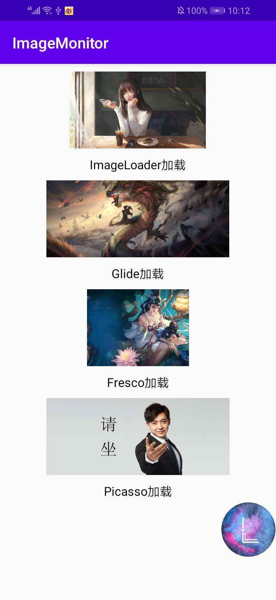

# LargeImageMonitor

<h1 align="center">
  
 </h1>
 
 
 
 
 
 
### 背景
 在平时开发中，我们经常会出现OOM和APK体积过大的情况，其中有很大的原因在于图片过大。当图片占用内存过大，内存不足时就会导致OOM。而图片的文件太大，会导致在打包成APK后，APK的体积增加。对于本地加载的图片，UI给我们图时，我们或许会下意识看一眼文件大小，如果文件太大我们可能会跟UI小姐姐进行沟通。但是对于从网络加载图片，很多时候客户端拿到的只是一个URL，我们并不知道要加载的图片大小，这时候就有可能造成图片过大的情况。
 
### 介绍
LargeImageMonitor是一个使用ASM进行字节码插桩的大图监控框架，可以对我们要加载的图片进行监控，如果出现图片超过阈值的情况会进行报警。

### 功能与特点
&nbsp;&nbsp;&nbsp;&nbsp;1.支持Glide,Fresco,Picasso,Universal Image Loader。

&nbsp;&nbsp;&nbsp;&nbsp;2.可以对图片的文件大小设置阈值。

&nbsp;&nbsp;&nbsp;&nbsp;3.可以对图片所占用的内存大小设置阈值。

&nbsp;&nbsp;&nbsp;&nbsp;4.可以通过弹窗或者列表的方式查看超过阈值的图片。

&nbsp;&nbsp;&nbsp;&nbsp;5.支持Androidx。

### 效果

    

